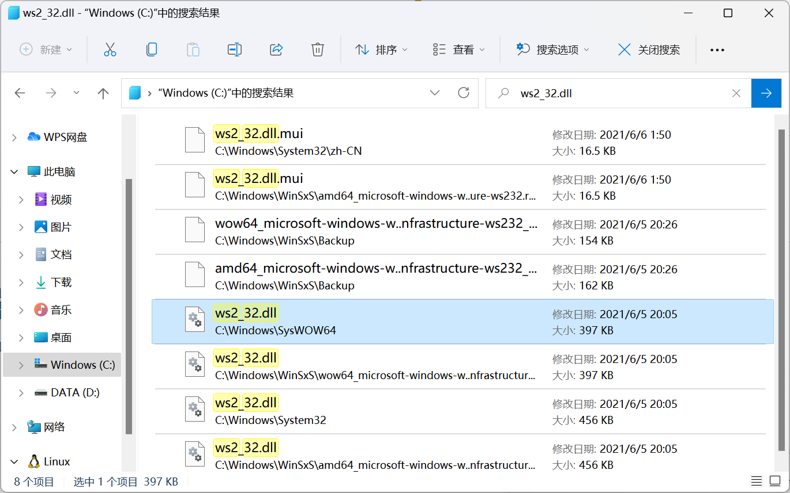
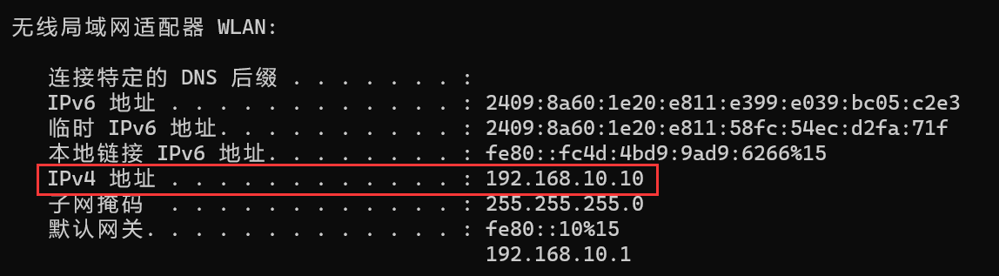

本教程面向CPL2022期末大作业，简单介绍利用`WINAPI`进行**网络编程**的环境配置和基础使用，同时还会附带一些简单的**多线程**内容

## 环境配置

### 通用配置

C语言利用`WINAPI`进行网络编程时的环境配置比较简单，首先需要引入头文件

~~~~c
#include <winsock2.h>
#include <windows.h>
#include <ws2tcpip.h>

//注意不要改变上述include的顺序，否则编译可能出warning
int main(){

    return 0;
}
~~~~

接下来，为了编译器能够成功链接到这两个库，只需要在C盘中找到`ws2_32.dll`文件，将它复制到项目文件夹下

然后就可以在终端输入以下命令进行编译了

~~~~bash
#需要先cd到项目目录下
gcc filename.c -o filename.exe -lws2_32
#filename处输入你的源代码文件名
~~~~

### CLion配置

如果想要使用CLion运行你的代码，就需要自己编辑`CMakeList`，在其中加入两句：

~~~~cmake
link_libraries(ws2_32)
target_link_libraries(filename ws2_32)
#filename同样是文件名
~~~~

## 网络编程教程

由于本教程使用的是`WINAPI`，因此你可以阅读[microsoft的官方手册文档](https://learn.microsoft.com/zh-cn/docs//)来查阅你遇到的问题

### 前置知识简要说明

#### ip地址

遵循ip协议的主机在上网时具有标识自己身份的唯一ip地址，上网者可以通过ip地址访问相应的主机

#### 文件传输协议

常见有TCP和UDP两种协议，用于控制和传输文件，两者有一定的区别但对本课程此次大作业来说并不重要，感兴趣的同学可以自行查阅资料进行学习

#### 端口

每台主机上每种传输协议都有0~65535共计65536个端口，每个端口可以绑定唯一的进程用于提供服务，这65536个端口可以分为3类：**周知端口**，**注册端口**和**动态端口**，其中周知端口用于绑定**固定的服务进程**，注册端口用于绑定**用户进程**，动态端口用于动态分配不固定绑定的进程类型，因此在此次作业中我们使用**注册端口**（1024到49151）

#### 进程

进程可以简单地理解为一个程序，当一个进程与某一主机的某一端口绑定之后，访问者通过主机ip+相应端口号的形式访问时，提供服务的就是与这个端口相绑定的进程

### 代码分解

#### server

服务端是提供网络服务的，它需要完成上述的绑定过程，使客户端可以通过ip+端口号的方式请求对应的服务

第一步，服务端要完成网络服务的初始化，需要指出的是所有的网络服务都存在着请求失败的风险，并且由于网络稳定性未知，此风险系数并不低，所以需要为可能出现的错误做好预案，类似于`malloc`函数如果分配内存失败就会返回空指针`NULL`，因此理论上在用到malloc函数的地方都应该判断得到的指针是否为空

~~~~c
WSADATA wsaData;
int iResult;
/*
    MethodName: WSAStartup
    @mannual: https://learn.microsoft.com/zh-cn/windows/win32/api/winsock/nf-winsock-wsastartup
    网络服务初始化(Web Server API)，第一个参数为需求的最低socket版本号，示例使用的是2.2版本
*/
iResult = WSAStartup(MAKEWORD(2, 2), &wsaData);

//如果初始化失败则报错并打印错误信息（iResult），网络编程中需要时刻注意中途可能出现的错误并给予返回信息
if (iResult != 0) {
    printf("WSAStartup failed: %d\n", iResult);
    //自带收尾工作的return 1，返回值为1表示程序未正常结束
    exit(1);
}
~~~~

第二步，服务端需要获取自己对应注册端口的通信协议类型，地址信息等内容

~~~~c
struct addrinfo *result, *ptr, hints;
//为getaddrinfo函数做准备
memset(&hints, 0, sizeof(struct addrinfo));
//IPV4地址
hints.ai_family = AF_INET;
hints.ai_socktype = SOCK_STREAM;
//TCP协议
hints.ai_protocol = IPPROTO_TCP;
//服务端被动绑定
hints.ai_flags = AI_PASSIVE;

/*
    MethodName: getaddrinfo
    @mannual: https://learn.microsoft.com/zh-cn/windows/win32/api/ws2tcpip/nf-ws2tcpip-getaddrinfo
    8080表示端口号，取值范围为0~65535，但有些端口为保留端口，使用前请先查询目标端口是否被占用
    getaddrinfo函数提供从主机名到地址的独立于协议的转换，结果记录在result中
*/
iResult = getaddrinfo(NULL, "8080", &hints, &result);

if (iResult != 0) {
    printf("getaddrinfo failed: %d\n", iResult);
    WSACleanup();
    exit(1);
}
~~~~

第三步，服务端需要创建一个适配相应端口信息的套接字（socket）

~~~~c
SOCKET listen_socket = INVALID_SOCKET;
/*
    MethodName: socket
    @mannual: https://learn.microsoft.com/zh-cn/windows/win32/api/winsock2/nf-winsock2-socket
    socket函数根据getaddrinfo函数返回的信息创建一个绑定到相应端口的套接字
*/
listen_socket = socket(result->ai_family, result->ai_socktype, result->ai_protocol);

if (listen_socket == INVALID_SOCKET) {
    printf("socket() failed: %d\n", WSAGetLastError());
    freeaddrinfo(result);
    WSACleanup();
    exit(1);
}
~~~~

第四步，服务端将本地地址和套接字绑定，也就意味着当前进程与端口绑定完成，此后获取到的端口地址信息不再会被使用，为了防止内存泄漏的风险需要将其释放

~~~~c
/*
    MethodName: bind
    @mannual: https://learn.microsoft.com/zh-cn/windows/win32/api/winsock/nf-winsock-bind
    绑定函数将本地地址与套接字相关联
*/
iResult = bind(listen_socket, result->ai_addr, (int)result->ai_addrlen);

//绑定完成后，释放不再使用的内存空间
freeaddrinfo(result);

if (iResult == SOCKET_ERROR) {
    printf("bind() failed: %d\n", WSAGetLastError());
    closesocket(listen_socket);
    WSACleanup();
    exit(1);
}
~~~~

第五步，启动监听，服务端开始侦听向相应端口发起的请求

~~~~c
/*
    MethodName: listen
    @mannual: https://learn.microsoft.com/zh-cn/windows/win32/api/winsock2/nf-winsock2-listen
    侦听函数将套接字置于侦听传入连接的状态
*/
if (listen(listen_socket, SOMAXCONN) == SOCKET_ERROR) {
    printf("listen() failed: %d\n", WSAGetLastError());
    closesocket(listen_socket);
    WSACleanup();
    return 1;
}
~~~~

接下来，服务端就可以开始与客户端建立连接，下面的代码是服务端与两个客户端连接的例子

~~~~c
//预备用户套接字
SOCKET client_socket[2] = {INVALID_SOCKET};
for (int i = 0; i <= 1; i++) {
    /*
        MethodName: accept
        @mannual: https://learn.microsoft.com/zh-cn/windows/win32/api/winsock2/nf-winsock2-accept
        accept函数允许在套接字上尝试传入连接
    */
    client_socket[i] = accept(listen_socket, NULL, NULL);

    if (client_socket[i] == INVALID_SOCKET) {
        printf("accept() failed: %d\n", WSAGetLastError());
        closesocket(listen_socket);
        WSACleanup();
        exit(1);
    }
}
~~~~

至此，服务端就与客户端完成了连接的建立

#### client

相对来说，客户端需要处理的事情没有那么复杂，它只需要获取已经启动的服务端的信息，并与之连接即可

因此，客户端代码的第一步是初始化网络服务并获取服务端相应端口的信息

~~~~c
WSADATA wsadata;
int iResult;

iResult = WSAStartup(MAKEWORD(2, 2), &wsadata);

if (iResult != 0) {
    printf("WSAStartup failed: %d\n", iResult);
    exit(1);
}

struct addrinfo *result, *ptr, hints;
memset(&hints, 0, sizeof(struct addrinfo));
hints.ai_family = AF_UNSPEC;
hints.ai_socktype = SOCK_STREAM;
hints.ai_protocol = IPPROTO_TCP;

//127.0.0.1是特殊地址，指向当前主机，也可写作localhost，端口与服务器端口相对应
iResult = getaddrinfo("127.0.0.1", "8080", &hints, &result);

if (iResult != 0) {
    printf("getaddrinfo failed: %d\n", iResult);
    WSACleanup();
    exit(1);
}
~~~~

第二步，客户端需要根据得到的信息构建服务端的套接字

~~~~c
SOCKET server_socket = INVALID_SOCKET;
ptr = result;
server_socket = socket(ptr->ai_family, ptr->ai_socktype, ptr->ai_protocol);

if (server_socket == INVALID_SOCKET) {
    printf("socket() failed: %d\n", WSAGetLastError());
    freeaddrinfo(result);
    closesocket(server_socket);
    WSACleanup();
    exit(1);
}
~~~~

最后，客户端尝试与服务端进行连接，同样为了避免内存泄露，此处可以释放不再会用到的服务端端口信息

~~~~c
/*
    MethodName: connect
    @mannual: https://learn.microsoft.com/zh-cn/windows/win32/api/winsock2/nf-winsock2-connect
    connect函数建立与指定套接字的连接
*/
if (connect(server_socket, ptr->ai_addr, (int)ptr->ai_addrlen) ==
    SOCKET_ERROR) {
    printf("connect() failed.\n");
    system("pause");
    freeaddrinfo(result);
    closesocket(server_socket);
    WSACleanup();
    exit(1);
}

freeaddrinfo(result);
~~~~

#### 信息收发

由于收发消息两端通用，这里就以客户端为例，分别使用`send`和`recv`函数进行信息的发送和接收

~~~~c
printf("please input a string.\n");
char buf[1024];
memset(buf, 0, sizeof(buf));
while(scanf("%s", buf)){
    iResult = send(server_socket, buf, strlen(buf), 0);
    if (iResult == SOCKET_ERROR) {
        printf("send failed: %d\n", WSAGetLastError());
        closesocket(server_socket);
        WSACleanup();
        exit(1);
    }
    printf("Bytes send: %d\n", iResult);
    iResult = recv(server_socket, buf, 1000, 0);
    if (iResult > 0) {
        printf("Bytes received: %d\n", iResult);
        printf("%s\n", buf);
    } else if (iResult == 0) {
        printf("Connection closing ...\n");
        system("pause");
    } else {
        printf("recv failed: %d\n", WSAGetLastError());
        closesocket(server_socket);
        WSACleanup();
        exit(1);
    }
    system("pause");
}
~~~~

### 完整代码

下面给出的示例代码实现了服务端向两个客户端提供服务，客户端输入一串字符串，发送给服务端，服务端将其转化为大写后传回给客户端，客户端进行打印

#### server.c

~~~~c
/*
    https://learn.microsoft.com/zh-cn/docs//
    可参考WINAPI官方文档手册
*/
#include <stdio.h>
#include <winsock2.h>
#include <windows.h>
#include <ws2tcpip.h>
int main() {
    printf("This is the server.\n");
    WSADATA wsaData;
    int iResult;
    /*
        MethodName: WSAStartup
        @mannual: https://learn.microsoft.com/zh-cn/windows/win32/api/winsock/nf-winsock-wsastartup
        网络服务初始化(Web Server API)，第一个参数为需求的最低socket版本号，示例使用的是2.2版本
    */
    iResult = WSAStartup(MAKEWORD(2, 2), &wsaData);

    //如果初始化失败则报错并打印错误信息（iResult），网络编程中需要时刻注意中途可能出现的错误并给予返回信息
    if (iResult != 0) {
        printf("WSAStartup failed: %d\n", iResult);
        //自带收尾工作的return 1，返回值为1表示程序未正常结束
        exit(1);
    }
    struct addrinfo *result, *ptr, hints;
    //为getaddrinfo函数做准备
    memset(&hints, 0, sizeof(struct addrinfo));
    //IPV4地址
    hints.ai_family = AF_INET;
    hints.ai_socktype = SOCK_STREAM;
    //TCP协议
    hints.ai_protocol = IPPROTO_TCP;
    //服务端被动绑定
    hints.ai_flags = AI_PASSIVE;

    /*
        MethodName: getaddrinfo
        @mannual: https://learn.microsoft.com/zh-cn/windows/win32/api/ws2tcpip/nf-ws2tcpip-getaddrinfo
        8080表示端口号，取值范围为0~65535，但有些端口为保留端口，使用前请先查询目标端口是否被占用
        getaddrinfo函数提供从主机名到地址的独立于协议的转换，结果记录在result中
    */
    iResult = getaddrinfo(NULL, "8080", &hints, &result);
    
    if (iResult != 0) {
        printf("getaddrinfo failed: %d\n", iResult);
        WSACleanup();
        exit(1);
    }

    SOCKET listen_socket = INVALID_SOCKET;
    /*
        MethodName: socket
        @mannual: https://learn.microsoft.com/zh-cn/windows/win32/api/winsock2/nf-winsock2-socket
        socket函数根据getaddrinfo函数返回的信息创建一个绑定到相应端口的套接字
    */
    listen_socket = socket(result->ai_family, result->ai_socktype, result->ai_protocol);

    if (listen_socket == INVALID_SOCKET) {
        printf("socket() failed: %d\n", WSAGetLastError());
        freeaddrinfo(result);
        WSACleanup();
        exit(1);
    }

    /*
        MethodName: bind
        @mannual: https://learn.microsoft.com/zh-cn/windows/win32/api/winsock/nf-winsock-bind
        绑定函数将本地地址与套接字相关联
    */
    iResult = bind(listen_socket, result->ai_addr, (int)result->ai_addrlen);

    //绑定完成后，释放不再使用的内存空间
    freeaddrinfo(result);

    if (iResult == SOCKET_ERROR) {
        printf("bind() failed: %d\n", WSAGetLastError());
        closesocket(listen_socket);
        WSACleanup();
        exit(1);
    }

    /*
        MethodName: listen
        @mannual: https://learn.microsoft.com/zh-cn/windows/win32/api/winsock2/nf-winsock2-listen
        侦听函数将套接字置于侦听传入连接的状态
    */
    if (listen(listen_socket, SOMAXCONN) == SOCKET_ERROR) {
        printf("listen() failed: %d\n", WSAGetLastError());
        closesocket(listen_socket);
        WSACleanup();
        return 1;
    }
    
    //预备用户套接字
    SOCKET client_socket[2] = {INVALID_SOCKET};
    for (int i = 0; i <= 1; i++) {
        /*
            MethodName: accept
            @mannual: https://learn.microsoft.com/zh-cn/windows/win32/api/winsock2/nf-winsock2-accept
            accept函数允许在套接字上尝试传入连接
        */
        client_socket[i] = accept(listen_socket, NULL, NULL);

        if (client_socket[i] == INVALID_SOCKET) {
            printf("accept() failed: %d\n", WSAGetLastError());
            closesocket(listen_socket);
            WSACleanup();
            exit(1);
        }
    }

    //连接成功建立
    printf("connection established!\n");

    //信息接收数组以及初始化
    char buf[1024];
    memset(buf, 0, sizeof(buf));

    //服务端程序需要在开机时持续执行
    while(1){
        /*
            MethodName: recv
            @mannual: https://learn.microsoft.com/zh-cn/windows/win32/api/winsock/nf-winsock-recv
            recv函数从连接的套接字或绑定的无连接套接字接收数据，返回值是接收到的字符数
        */
        iResult = recv(client_socket[0], buf, 1000, 0); 

        if (iResult > 0) {
            printf("Bytes received: %d\n", iResult);
            printf("%s\n", buf);
            for (int i = 0; i < iResult; i++) {
                if (buf[i] >= 'a' && buf[i] <= 'z')
                    buf[i] -= 32;
                else if (buf[i] == 0)
                    break;
            }
            /*
                MethodName: send
                @mannual: https://learn.microsoft.com/zh-cn/windows/win32/api/winsock2/nf-winsock2-send
                send函数在连接的套接字上发送数据
            */
            int iSendResult = send(client_socket[0], buf, iResult, 0);
            if (iSendResult == SOCKET_ERROR) {
                printf("send failed: %d\n", WSAGetLastError());
                closesocket(client_socket[0]);
                closesocket(client_socket[1]);
                WSACleanup();
                exit(1);
            }
        } else if (iResult == 0) {
            printf("Connection closing ...\n");
            system("pause");
        } else {
            printf("recv failed: %d\n", WSAGetLastError());
            closesocket(client_socket[0]);
            closesocket(client_socket[1]);
            WSACleanup();
            exit(1);
        }

        //第二个客户端，更多客户端应该使用for循环进行，但是如果这么处理存在怎样的问题？
        iResult = recv(client_socket[1], buf, 1000, 0);
        if (iResult > 0) {
            printf("Bytes received: %d\n", iResult);
            printf("%s\n", buf);
            for (int i = 0; i <= 1000; i++) {
                if (buf[i] >= 'a' && buf[i] <= 'z')
                    buf[i] -= 32;
                else if (buf[i] == 0)
                    break;
            }
            int iSendResult = send(client_socket[1], buf, iResult, 0);
            if (iSendResult == SOCKET_ERROR) {
                printf("send failed: %d\n", WSAGetLastError());
                closesocket(client_socket[0]);
                closesocket(client_socket[1]);
                WSACleanup();
                exit(1);
            }
        } else if (iResult == 0) {
            printf("Connection closing ...\n");
            system("pause");
        } else {
            printf("recv failed: %d\n", WSAGetLastError());
            closesocket(client_socket[0]);
            closesocket(client_socket[1]);
            WSACleanup();
            exit(1);
        }
    }
    return 0;
}
~~~~

#### client.c

~~~~c
#include <stdio.h>
#include <winsock2.h>
#include <windows.h>
#include <ws2tcpip.h>
int main() {
    printf("This is the client.\n");
    WSADATA wsadata;
    int iResult;

    iResult = WSAStartup(MAKEWORD(2, 2), &wsadata);

    if (iResult != 0) {
        printf("WSAStartup failed: %d\n", iResult);
        exit(1);
    }

    struct addrinfo *result, *ptr, hints;
    memset(&hints, 0, sizeof(struct addrinfo));
    hints.ai_family = AF_UNSPEC;
    hints.ai_socktype = SOCK_STREAM;
    hints.ai_protocol = IPPROTO_TCP;

    //127.0.0.1是特殊地址，指向当前主机，也可写作localhost，端口与服务器端口相对应
    iResult = getaddrinfo("127.0.0.1", "8080", &hints, &result);

    if (iResult != 0) {
        printf("getaddrinfo failed: %d\n", iResult);
        WSACleanup();
        exit(1);
    }

    SOCKET server_socket = INVALID_SOCKET;
    ptr = result;
    server_socket = socket(ptr->ai_family, ptr->ai_socktype, ptr->ai_protocol);

    if (server_socket == INVALID_SOCKET) {
        printf("socket() failed: %d\n", WSAGetLastError());
        freeaddrinfo(result);
        closesocket(server_socket);
        WSACleanup();
        exit(1);
    }

    /*
        MethodName: connect
        @mannual: https://learn.microsoft.com/zh-cn/windows/win32/api/winsock2/nf-winsock2-connect
        connect函数建立与指定套接字的连接
    */
    if (connect(server_socket, ptr->ai_addr, (int)ptr->ai_addrlen) ==
        SOCKET_ERROR) {
        printf("connect() failed.\n");
        system("pause");
        freeaddrinfo(result);
        closesocket(server_socket);
        WSACleanup();
        exit(1);
    }

    freeaddrinfo(result);

    printf("connection established!\n");
    system("pause");
    printf("please input a string.\n");
    char buf[1024];
    memset(buf, 0, sizeof(buf));
    while(scanf("%s", buf)){
        iResult = send(server_socket, buf, strlen(buf), 0);
        if (iResult == SOCKET_ERROR) {
            printf("send failed: %d\n", WSAGetLastError());
            closesocket(server_socket);
            WSACleanup();
            exit(1);
        }
        printf("Bytes send: %d\n", iResult);
        iResult = recv(server_socket, buf, 1000, 0);
        if (iResult > 0) {
            printf("Bytes received: %d\n", iResult);
            printf("%s\n", buf);
        } else if (iResult == 0) {
            printf("Connection closing ...\n");
            system("pause");
        } else {
            printf("recv failed: %d\n", WSAGetLastError());
            closesocket(server_socket);
            WSACleanup();
            exit(1);
        }
        system("pause");
    }
    return 0;
}
~~~~

#### 有什么问题

阻塞问题：

- 当第一个客户端与服务端建立连接后，如果第二个客户端不进入连接，第一个客户端就无法获取服务
- 当某一个客户端连续请求服务时，它必须等待另一个客户端先请求服务才能得到响应
- 当客户端得不到服务端的响应时，客户端程序不会响应用户的操作

## 多线程教程

### 定义简介

多线程是一种**并发处理**机制，它通过特定的办法使得多个任务在直观感觉上同步进行

### 思路分析

上面出现的阻塞问题分别是因为：

- **send和recv函数在发出/收到消息前会阻塞程序的继续执行**
- 监听客户端接入的代码先于服务代码执行
- 两个客户端享受服务具有先后次序关系
- 客户端获取用户输入的代码和接收服务端消息的代码的执行具有先后次序关系

要解决这两个问题，我们可以让：

- 服务端监听客户端接入的代码和服务客户端的代码同时执行
- 服务端服务多个客户端的代码同时执行
- 客户端获取用户输入的代码和与服务器保持连接的代码同时执行

因此，具体的措施是：

- 当服务端监听到客户端接入，就创建新的线程来服务这个客户端
- 当客户端用户输入数据后，就将数据放入队列，与服务端连接的线程保持执行，只要队列不为空就向服务端发送消息，收到消息后就将收到的数据打印到屏幕上

### 完整代码

现在，服务端服务的数量不再是确定的，只要不超过负荷服务端就可以动态改变服务的客户端数量

~~不过对于这次大作业作用不大就是了~~

#### server.c

~~~~c
/*
    https://learn.microsoft.com/zh-cn/docs//
    可参考WINAPI官方文档手册
*/
#include <stdio.h>
#include <stdlib.h>
#include <winsock2.h>
#include <windows.h>
#include <ws2tcpip.h>
void maintainContact(SOCKET* client_socket){
    //信息接收数组以及初始化
    char buf[1024];
    memset(buf, 0, sizeof(buf));

    //服务端程序需要在开机时持续执行
    while(1){
        /*
            MethodName: recv
            @mannual: https://learn.microsoft.com/zh-cn/windows/win32/api/winsock/nf-winsock-recv
            recv函数从连接的套接字或绑定的无连接套接字接收数据，返回值是接收到的字符数
        */
        int iResult = recv(*client_socket, buf, 1000, 0); 

        if (iResult > 0) {
            printf("Bytes received: %d\n", iResult);
            printf("%s\n", buf);
            for (int i = 0; i < iResult; i++) {
                if (buf[i] >= 'a' && buf[i] <= 'z')
                    buf[i] -= 32;
                else if (buf[i] == 0)
                    break;
            }
            /*
                MethodName: send
                @mannual: https://learn.microsoft.com/zh-cn/windows/win32/api/winsock2/nf-winsock2-send
                send函数在连接的套接字上发送数据
            */
            int iSendResult = send(*client_socket, buf, iResult, 0);
            if (iSendResult == SOCKET_ERROR) {
                printf("send failed: %d\n", WSAGetLastError());
                closesocket(*client_socket);
                WSACleanup();
                exit(1);
            }
        } else if (iResult == 0) {
            printf("Connection closing ...\n");
            system("pause");
        } else {
            printf("recv failed: %d\n", WSAGetLastError());
            closesocket(*client_socket);
            WSACleanup();
            exit(1);
        }
    }
    return;
}
void buildConnection(SOCKET* listen_socket){
    while(1){
        //为新客户端套接字分配空间并初始化
        SOCKET* client_socket = malloc(sizeof(SOCKET));
        *client_socket = INVALID_SOCKET;
        /*
            MethodName: accept
            @mannual: https://learn.microsoft.com/zh-cn/windows/win32/api/winsock2/nf-winsock2-accept
            accept函数允许在套接字上尝试传入连接
        */
        *client_socket = accept(*listen_socket, NULL, NULL);

        if (*client_socket == INVALID_SOCKET) {
            printf("accept() failed: %d\n", WSAGetLastError());
            closesocket(*listen_socket);
            WSACleanup();
            exit(1);
        }

        //连接成功建立
        printf("connection established!\n");
        //建立通信线程
        /*
            MethodName: CreateThread
            @mannual: https://learn.microsoft.com/zh-cn/windows/win32/api/processthreadsapi/nf-processthreadsapi-createthread
            创建在调用进程的虚拟地址空间内执行的线程
        */
        CreateThread(NULL, (SIZE_T)NULL, (LPTHREAD_START_ROUTINE)maintainContact, client_socket, (DWORD)0UL, NULL);
    }
    return;
}
int main() {
    printf("This is the multi-thread server.\n");
    WSADATA wsaData;
    int iResult;
    /*
        MethodName: WSAStartup
        @mannual: https://learn.microsoft.com/zh-cn/windows/win32/api/winsock/nf-winsock-wsastartup
        网络服务初始化(Web Server API)，第一个参数为需求的最低socket版本号，示例使用的是2.2版本
    */
    iResult = WSAStartup(MAKEWORD(2, 2), &wsaData);

    //如果初始化失败则报错并打印错误信息（iResult），网络编程中需要时刻注意中途可能出现的错误并给予返回信息
    if (iResult != 0) {
        printf("WSAStartup failed: %d\n", iResult);
        //自带收尾工作的return 1，返回值为1表示程序未正常结束
        exit(1);
    }
    struct addrinfo *result, *ptr, hints;
    //为getaddrinfo函数做准备
    memset(&hints, 0, sizeof(struct addrinfo));
    //IPV4地址
    hints.ai_family = AF_INET;
    hints.ai_socktype = SOCK_STREAM;
    //TCP协议
    hints.ai_protocol = IPPROTO_TCP;
    //服务端被动绑定
    hints.ai_flags = AI_PASSIVE;

    /*
        MethodName: getaddrinfo
        @mannual: https://learn.microsoft.com/zh-cn/windows/win32/api/ws2tcpip/nf-ws2tcpip-getaddrinfo
        8080表示端口号，取值范围为0~65535，但有些端口为保留端口，使用前请先查询目标端口是否被占用
        getaddrinfo函数提供从主机名到地址的独立于协议的转换，结果记录在result中
    */
    iResult = getaddrinfo(NULL, "8080", &hints, &result);
    
    if (iResult != 0) {
        printf("getaddrinfo failed: %d\n", iResult);
        WSACleanup();
        exit(1);
    }

    SOCKET listen_socket = INVALID_SOCKET;
    /*
        MethodName: socket
        @mannual: https://learn.microsoft.com/zh-cn/windows/win32/api/winsock2/nf-winsock2-socket
        socket函数根据getaddrinfo函数返回的信息创建一个绑定到相应端口的套接字
    */
    listen_socket = socket(result->ai_family, result->ai_socktype, result->ai_protocol);

    if (listen_socket == INVALID_SOCKET) {
        printf("socket() failed: %d\n", WSAGetLastError());
        freeaddrinfo(result);
        WSACleanup();
        exit(1);
    }

    /*
        MethodName: bind
        @mannual: https://learn.microsoft.com/zh-cn/windows/win32/api/winsock/nf-winsock-bind
        绑定函数将本地地址与套接字相关联
    */
    iResult = bind(listen_socket, result->ai_addr, (int)result->ai_addrlen);

    //绑定完成后，释放不再使用的内存空间
    freeaddrinfo(result);

    if (iResult == SOCKET_ERROR) {
        printf("bind() failed: %d\n", WSAGetLastError());
        closesocket(listen_socket);
        WSACleanup();
        exit(1);
    }

    /*
        MethodName: listen
        @mannual: https://learn.microsoft.com/zh-cn/windows/win32/api/winsock2/nf-winsock2-listen
        侦听函数将套接字置于侦听传入连接的状态
    */
    if (listen(listen_socket, SOMAXCONN) == SOCKET_ERROR) {
        printf("listen() failed: %d\n", WSAGetLastError());
        closesocket(listen_socket);
        WSACleanup();
        return 1;
    }

    //建立连接线程
    buildConnection(&listen_socket);
    return 0;
}
~~~~

#### client.c

~~~~c
#include <stdio.h>
#include <stdbool.h>
#include <winsock2.h>
#include <windows.h>
#include <ws2tcpip.h>
typedef struct NODE{
    int request_id;
    char buf[1024];
    struct NODE* next;
}node;
node *request_queue;
SOCKET server_socket;
int cnt;
node *getLastElement(node *ptr){
    node *p = ptr;
    while(p->next)p = p->next;
    return p;
}
node *getHead(node *ptr){
    return ptr->next;
}
void removeHead(node *ptr){
    ptr->next = ptr->next->next;
}
bool isEmpty(node *ptr){
    return ptr->next == NULL;
}
void inputController(){
    request_queue = malloc(sizeof(node));
    request_queue->next = NULL;
    while(printf("please input the string of request NO.%d\n", ++cnt)){
        node* request = malloc(sizeof(node));
        request->request_id = cnt;
        memset(request->buf, 0, sizeof(request->buf));
        request->next = NULL;
        scanf("%s", request->buf);
        getLastElement(request_queue)->next = request;
    }
    return;
}
void maintainContact(){
    while(1){
        if(!isEmpty(request_queue)){
            node *head = getHead(request_queue);
            int iResult = send(server_socket, head->buf, strlen(head->buf), 0);
            if (iResult == SOCKET_ERROR) {
                printf("send failed: %d\n", WSAGetLastError());
                closesocket(server_socket);
                WSACleanup();
                exit(1);
            }
            node* ans = malloc(sizeof(node));
            ans->request_id = head->request_id;
            memset(ans->buf, 0, sizeof(ans->buf));
            ans->next = NULL;
            iResult = recv(server_socket, ans->buf, 1000, 0);
            printf("request NO.%d has been answered: %s\n", ans->request_id, ans->buf);
            removeHead(request_queue);
        }
        Sleep(100);
    }
}
int main() {
    printf("This is the client.\n");
    WSADATA wsadata;
    int iResult;

    iResult = WSAStartup(MAKEWORD(2, 2), &wsadata);

    if (iResult != 0) {
        printf("WSAStartup failed: %d\n", iResult);
        exit(1);
    }

    struct addrinfo *result, *ptr, hints;
    memset(&hints, 0, sizeof(struct addrinfo));
    hints.ai_family = AF_UNSPEC;
    hints.ai_socktype = SOCK_STREAM;
    hints.ai_protocol = IPPROTO_TCP;

    //127.0.0.1是特殊地址，指向当前主机，也可写作localhost，端口与服务器端口相对应
    iResult = getaddrinfo("127.0.0.1", "8080", &hints, &result);

    if (iResult != 0) {
        printf("getaddrinfo failed: %d\n", iResult);
        WSACleanup();
        exit(1);
    }

    server_socket = INVALID_SOCKET;
    ptr = result;
    server_socket = socket(ptr->ai_family, ptr->ai_socktype, ptr->ai_protocol);

    if (server_socket == INVALID_SOCKET) {
        printf("socket() failed: %d\n", WSAGetLastError());
        freeaddrinfo(result);
        closesocket(server_socket);
        WSACleanup();
        exit(1);
    }

    /*
        MethodName: connect
        @mannual: https://learn.microsoft.com/zh-cn/windows/win32/api/winsock2/nf-winsock2-connect
        connect函数建立与指定套接字的连接
    */
    if (connect(server_socket, ptr->ai_addr, (int)ptr->ai_addrlen) ==
        SOCKET_ERROR) {
        printf("connect() failed.\n");
        system("pause");
        freeaddrinfo(result);
        closesocket(server_socket);
        WSACleanup();
        exit(1);
    }

    freeaddrinfo(result);

    printf("connection established!\n");
    
    //建立服务器通信线程
    CreateThread(NULL, (SIZE_T)NULL, (LPTHREAD_START_ROUTINE)maintainContact, NULL, (DWORD)0UL, NULL);
    //建立客户端输入输出进程
    inputController();

    return 0;
}
~~~~

## 测试时如何联机

如果你有幸能找到和你一起测试程序的~~怨种~~朋友，这份教程也会教你怎么联机😄

### 局域网联机

运行客户端程序的设备需要和运行服务端程序的设备位于同一个局域网内（可以有一台设备既运行服务端也运行客户端），接下来，你需要在运行服务端程序的设备上查找到它的ip地址，对于windows用户，你可以使用win+R，输入cmd呼出命令行，然后输入ipconfig，找到自己的**局域网IPv4地址**（一般以192.168或者172.开头），将客户端程序`getaddrinfo`函数的第一个参数改为该ip地址，接下来就可以联机咯~

### 广域网联机

首先你需要一台具有公网ip的设备，可以是租借的服务器，也可以是你家里有的设备（如果真的有的话），请注意百度出来的ip地址并不一定是你真正的ip地址（多半不是），具体原因由于与本课程无关就不多赘述，感兴趣的同学可以自己查阅学习。接下来的操作非常类似，将客户端程序`getaddrinfo`函数的第一个参数改为该ip地址即可
